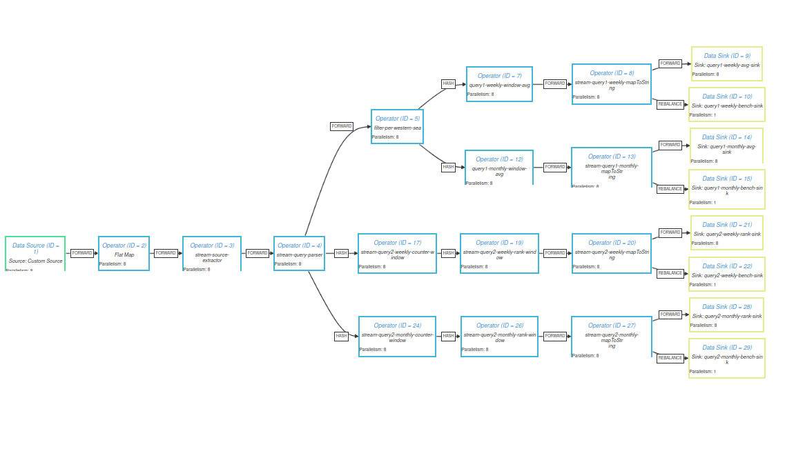

# SABD 2020/2021 Progetto 2

## Analisi di dati marittimi geo-spaziali


Questo Progetto usa Apache Flink per analizzare il dataset preso
da [Automatic Identification Systems](https://en.wikipedia.org/wiki/Automatic_identification_system) (AIS)
e contenuto nel file /data/dataset.csv per rispondere a delle query di interesse.

> Query 1: per ogni cella del Mar Meditteraraneo Occidentale e per ogni tipologia di nave
> si richiede di calcolare la media giornaliera delle navi su finestre temporali di:
> - 7 giorni
> - 1 mese

> Query 2: per il Mar Meditterraneo Occidentale e per quello Orientale si richiede di calcolare le 3 celle più frequentate nelle due
> fasce orarie: 00:00-11:59 e 12:00-23:59 su finestre temporali di:
> - 7 giorni
> - 1 mese

## Prerequisiti

- java 11
- docker e docker-compose
- maven
- Kafka
    - configurazione della variabile d'ambiente KAFKA_HOME
        ```bash
        export KAFKA_HOME=/usr/local/kafka
        export PATH=$PATH:$KAFKA_HOME/bin:$KAFKA_HOME/sbin
        ```

## Struttura del progetto

### dist

- docker-compose.yml
- start-dockers.sh per inizializzare i containers
- stop-dockers.sh per eliminare i kafka topic e fermare i container

### Results

- query1_weekly.csv contenente l'output della query 1 valutato su una finestra temporale settimanale
- query1_monthly.csv contenente l'output della query 1 valutato su una finestra temporale mensile
- query2_weekly.csv contenente l'output della query 2 valutato su una finestra temporale settimanale
- query2_monthly.csv contenente l'output della query 2 valutato su una finestra temporale mensile

### src

- benchmarking:  package contenente una classe sink per la valutazione sperimentale delle performance in termini di
  throughput medio e latenza.
- kafka_utils: package contenete delle classi che servono per l'interazione con Kafka per produrre record su topic,
  pubblicare i risultati dell'applicazione DS ed infine consumarli per essere riportati su un .csv.
- queries.query1 e queries.query2 : packages contenenti classi che definiscono la topologia rispettivamente della query
  1 e della query 2

## Modalità d'uso

### Ambiente usato per lo sviluppo e test


Inizializzare i container (Kafka brokers) e creazione dei vari topics con start-dockers.sh.

- Far Partire il Producer che pubblica il dataset su topic
- Far partire l'applicazione DSP con FlinkMain che prende i dati da kafka topic, li analizza e produce output su altri
  kafka topics.
- Far partire un consumer che che prende i dati prodotti dall'applicazione su Kafka e li scrive su .csv nella cartella
  Results.

Per testare l'applicazione è possibile utilizzare le configurazione di esecuzione fornite all'interno dell'ambiente
Intellij oppure usare .jar che è possibile generare con maven.

## Flink - Plan Visualization



per maggiori dettagli consultare il file DAG.json.

## Architettura per il test

I test sono stati effettuati su una macchina con le seguenti specifiche:

- CPU: Intel(R) Core(TM) i7-9700K CPU @ 3.60GHz sbloccato (up to 4900MHz)
- Motherboard: MPG Z390 GAMING PRO CARBON AC
- RAM: 16GB DIMM DDR4 Synchronous 3200 MHz (0.3 ns) CMK16GX4M2B3200C16 a 64bit
- Scheda grafica: MSI RTX 2070 super ventus